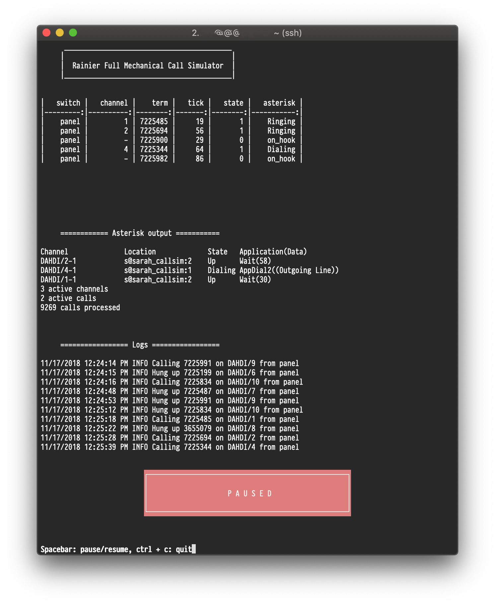

# panel_gen 
Auto call generator for the telephone switches at Connections Museum, Seattle.

Connections Museum has in its collection the last remaining "Panel" type telephone switch in the world. The switch functions, but mostly sits idle all day, since there is very little human-generated traffic to keep it busy. This program is my attempt to create a small load on the panel switch (and others at the museum) during idle time, so it appears to be processing calls from subscribers.


Requirements
------------
This project assumes you have the following:
* a computer running Asterisk (this has been tested on 11 and 13)
* a T1 card with DAHDI and libpri installed
* a channel bank of some sort containing FXO cards
* the required python modules installed:
	* tabulate
	* subprocess
	* numpy
	* pathlib
	* argparse
	* pycall
	* logging
	* curses
	* asterisk.ami

The DAHDI configs are part of this repo in the <code>etc</code> directory, and the Adit configs are part of this repository also. Please note that your hardware and software may vary from what I used, but the configs should be a good starting place nonetheless.

This program must be run as a user who is able to write to the following directories:
<code>/var/spool/asterisk</code> and <code>/var/log/panel_gen</code>. 
It also requires the ability to run <code>asterisk</code> and <code>tail</code>.

Setting up permissions on your system is an exercise left to the reader.<br />


Setup
-----
We have a PC with two TE110P T1 cards installed. One is for the museum's C\*NET connection, and the other is used specifically for this project. Astrisk is installed along with DAHDI and libpri. You can find a reasonable primer on this here: http://www.asteriskdocs.org/en/3rd_Edition/asterisk-book-html-chunk/installing_how_to_install_it.html

The T1 card connects to an Adit 600 channel bank near the Panel switch. The Adit is configured with a bunch of cards, but the important ones for us are the FXO cards in slots 4, 5, and 6. Each card supports 8 lines, so 3 cards supports a total of 24. These exit the Adit on a 25-pair cable and terminate on the IDF in the Panel switch. From the distributing frame, they are cabled to the Line Finder frame on the Panel, and the Line Link Frames on the Crossbar switches just like regular subscriber lines. (Please note that there has been some talk of the fact that hooking up a modern channel bank to an electromechanical switch can, over time, damage the delicate circuitry in the FXO cards. You may want to add some transient voltage protection. I find [these](https://www.mouser.com/ProductDetail/on-semiconductor/p6ke68a/?qs=nEYkbyTNQ5k4oguMQnTOuQ%3d%3d&countrycode=US&currencycode=USD) work very well. If you have questions, ask around on the C\*NET list @ http://www.ckts.info

Currently, <code>panel_gen</code> uses [pycall](https://github.com/rdegges/pycall) to put a .call file in the Asterisk spool directory. Asterisk monitors the spool directory, and when it sees a file there, it starts a call using the parameters in the file. It then either deletes the .call file, or moves it to another directory (depending on your configuration). This program also uses [python-ami](https://github.com/ettoreleandrotognoli/python-ami) to grab AMI events. I suspect that over time, the AMI will be used more and more, and pycall will be used less. 

This application requires a context in your dialplan to pass calls into. The simple context I use is below.

```
[sarah_callsim]

	exten => s,1,Wait(${waittime})
        exten => s,n,Hangup()
```

Usage
-----
Setting up Asterisk and a channel bank is way beyond the scope of this readme so lets assume you've somehow managed to do that without losing all your marbles.

There are two ways to run panel_gen:
* as a standalone application
* as a systemd service

Running the program as a standalone application will give you a nice curses UI, and accepts command line arguments outlined below. The application currently needs to be run with `sudo` in order to grab channel information from Asterisk. This will change when I get around to fixing it. The standalone application does not run the HTTP server, so all control must be done through passing arguments in to it.

The command line arguments have been mostly tested to work, but I can't make any guarantees that they won't blow something up in the process. Run <code>python panel_gen.py --help</code> to see them.

Running as a systemd service requires using the .service file in the "service/" directory. This method will cause the application to run like any other system service, and includes an HTTP/API server with all of the extra bells and whistles. This is how we normally run it at the museum. While running as a systemd service, you can connect to it with `console.py` to get a curses UI. Exiting `console.py` will have no effect on the service itself. If you want to go this route, you'll need to do the legwork to configure the service for your machine, as I've only tested this on mine.

The program is capable of generating calls from, and terminating calls to, any of the switches in the museum. The switch classes determines what the rules for each switch are, and they're set up with the switch capacities and limitations baked in. This way, if you are originating or terminating on any switch, panel_gen is intelligent enough to know if it's possible to make the call it's about to make.

The interface is divided into three areas, which should be mostly self-explanatory. The only bit that warrants some explanation is the main table at the top:

````
      __________________________________________
     |                                          |
     |  Rainier Full Mechanical Call Simulator  |
     |__________________________________________|


|   switch |   channel |    term |   tick |   state |   asterisk |
|---------:|----------:|--------:|-------:|--------:|-----------:|
|    panel |         1 | 7225720 |     34 |       1 |    Dialing |
|    panel |         - | 2325773 |      4 |       0 |    on_hook |
|    panel |        10 | 7225337 |    120 |       1 |    Ringing |

````
* **switch**: originating switch
* **channel**: DAHDI channel
* **term**: line being called
* **tick**: seconds before next event occurs
* **state**: line state according to Python
* **asterisk**: line state according to Asterisk

While running as a standalone application, there are a few magic keys you can use to control program flow. These have no effect when running as a system service, as all control should be done through the API.
* **spacebar**: pause/resume
* **u/d**: add/remove lines
* **ctrl + c**: hang up all lines and quit

HTTP Server
-----------
There is a simple, insecure HTTP server provided in `http-server.py` which serves up a basic web page so panel_gen can be executed via a volunteer's smartphone. This should not be available to everybody, as there are no security or sanity checks, and there's probably a thousand ways to break it. I keep it limited to a secure network so only those with the WPA key can access it. The actual server is [Flask](https://github.com/pallets/flask), and the CSS framework is [Skeleton](https://github.com/dhg/Skeleton). The smartphone interface pretends to be an app, but its really just a browser with a web page. It looks something like this:
<p align="center">
  
</p>

Panel_gen also provides an API via `http_server.py`! I launch this as a system service in Debian, which keeps it running 24/7. The API can be used to control the behavior of panel_gen externally, either using the aforementioned smartphone, or a key and lamp. You can poke the API with Postman, or with http://127.0.0.1/api/ui. We mostly use it to start and stop the demo during tours with a key and lamp discreetly mounted in our switches. See https://github.com/theautumn/tinyrobot for the code for that.

Examples
-------
I've created a bash alias to make this easier to run, but the following examples assume you've not done that. If you'd like to create one, you can edit ~/.bashrc, and add <code>alias panel_gen='sudo -u asterisk python ~/panel_gen/panel_gen.py'</code> to the end of the file. Change the directory where panel_gen lives, as necessary.

There are several different arguments you can use when running the program. Where arguments are not given by the user at runtime, defaults are assumed.

* ````python panel_gen.py```` Originates calls from the panel switch in random order.
* ````python panel_gen.py -o 5xb```` Originates calls from the No. 5 Crossbar in random order.
* ````python panel_gen.py -o 5xb -a 10```` Originates calls from the No. 5 Crossbar in random order. Maximum of 10 active lines.
* ````python panel_gen.py -o 5xb -t 1xb -a 2```` Originates calls from the No. 5 Crossbar to No. 1 Crossbar. Maximum of 2 active lines.
* ````python panel_gen.py -d -l 7225118```` Originates calls from the panel switch, one at a time, to 722-5118 with 15 second duration.

Caveats
-------
This program is designed to control a 100 year old, motor-driven analog switch. The fact that it has so many moving parts means that what looks good on paper is not always the way it behaves in real life. This is especially true when it comes to timing and control. Asterisk has no way of knowing what the switch is doing, outside of the normal subscriber supervision (on hook/off hook). The switch may return various call progress tones back to the caller, but there is currently no easy way for those tones to be recognized and acted upon. Because of this, I've tried to make sanity a priority, so the program should rarely--if ever--do things that the switches can't handle. I've also taken steps to make sure that the program won't "desync" from what Asterisk and the electromechanical switches are actually doing in real life. This element is a constant work in progress, as I discover more and more subtle bugs.

Secondly, this program is currently only compatible with Python 2.75. I've tried to convert to 3, but its just too much hassle. Sorry about that.
